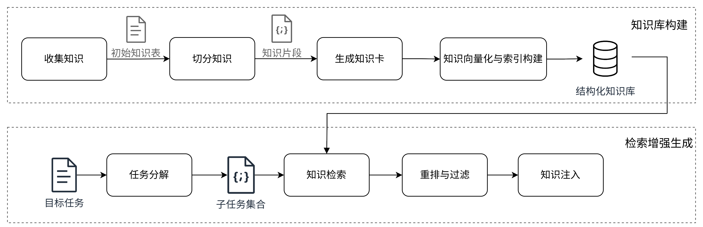
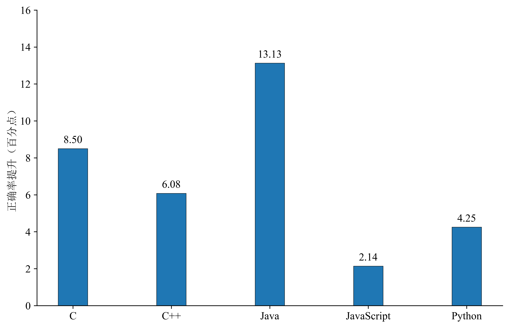

# 基于结构化知识的检索增强代码生成框架

面向大语言模型在算法编程任务中正确率不足的问题，围绕检索增强生成（RAG）思路，构建基于结构化知识的检索增强生成框架。通过引入外部算法知识，结合任务分解、知识检索、重排筛选与注入等机制，提升大模型代码生成能力。



## 研究概述
面向算法题场景下的代码生成任务，提出并实现了一套检索增强生成框架。该框架通过将结构化知识注入生成提示词（prompt）中，在不对模型参数进行任何修改的前提下，有效提升了Copilot生成代码的功能正确性。在知识建构方面，本文构建了一套结构化、可检索、可复用的知识库，作为检索增强框架的核心基础。

为系统评估该框架的实际效果，本文在大规模、跨语言、分难度的设定下开展了全面实验。评估数据集覆盖2613道LeetCode题目，涉及C、C++、Java、JavaScript与Python五种主流编程语言，涵盖Easy、Medium与Hard三类难度等级。实验结果显示，对于五种编程语言及不同难度的题目，通过知识注入均能够提升Copilot生成代码的正确率，其中，Java语言提升最大，实现了21.77\%的相对提升。相较于仅依赖模型直接生成的代码，知识注入后的代码在逻辑结构与语法上更为完整，降低了Wrong Answer与Compile Error发生的概率。本文还针对框架中的关键模块任务分解和重排过滤进行了消融实验。结果表明，引入任务分解能够提升检索请求的语义表达能力，使检索到的知识更准确地对齐子任务意图，从而提高召回知识的质量；重排与过滤则有效减少了低相关或不匹配的知识注入，降低了误导风险，保障大语言模型代码生成的稳定性。



## 仓库结构

当前仓库的主要目录如下：

```text
Knowledge-Augmented-Codegen/
├─ figures
├─ knowledge_base/         
├─ ProblemInfoCrawler/   
├─ evaluation/
   ├── result
   ├── S0
   └── S1
   └── S2
   └── S3
├─ src/
│  ├─ kb/                  
│  └─ rag/
├─ README.md              
└─ .gitignore

- **figures**: 项目相关图表。
- **knowledge_base**: 知识库构建过程中产生的关键文件，包括原始知识来源、知识切分结果、结构化知识卡片、向量索引文件及其元数据等。
- **ProblemInfoCrawler**: 自动收集 LeetCode 题目信息。
- **evaluation**: 代码生成结果的评测。
- **src**:项目核心。
  - **kb**：知识库构建相关代码，包括知识切分、知识卡片生成、受控词表以及向量索引构建等实现。
  - **rag**：检索增强生成相关代码，包括子任务分解、提示构造、知识检索与知识注入等流程实现。

